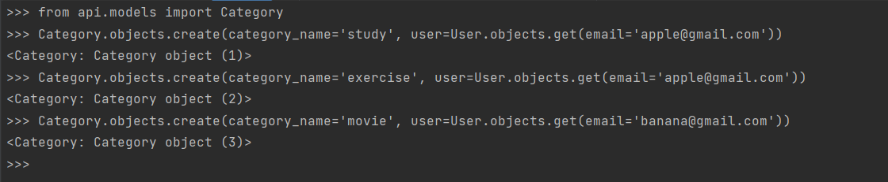
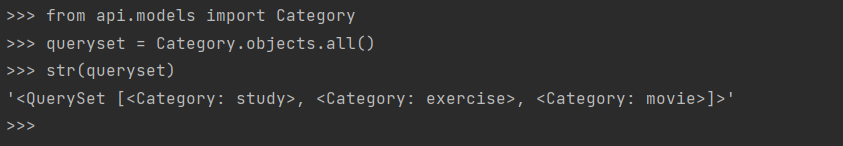
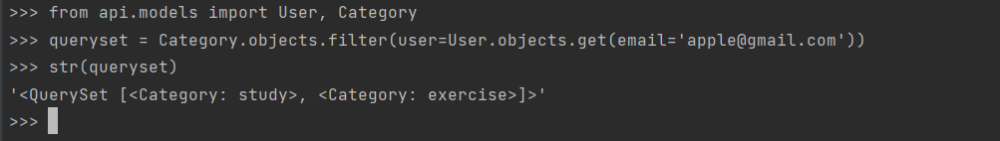
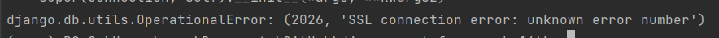

# CEOS 16기 백엔드 스터디 모델링 및 drf 연습을 위한 레포

## 2주차 미션: DB 모델링 및 Django ORM

## 투두메이트
일정 관리(투두리스트) 서비스.  
다른 사용자들에게 자신의 투두리스트를 공유할 수 있다는 차별점이 있다.  
서로 좋아요 등을 남길 수도 있고, 그래서 더 동기부여가 된다!

## 모델 설계

### User
django에서 기본 제공하는 user 모델 상속  - AbstractUser를 상속받아 custom함
- email을 유저네임으로 사용하도록 custom

### Friends
- user: Profile을 참조하는 foreign key
- subscription: user가 팔로우하는 친구들의 이메일이 저장됨.

### Category
- category_name: 카테고리명
- user : Profile을 참조하는 foreign key, 어떤 사용자의 카테고리인지 보여줌

### Todo
- todo_name: to do item을 작성했을 때 그것의 이름
- user: 작성한 사용자
- category: 카테고리
- public: 친구들에게 공개할 것인지 여부, private(비공개), only friends(친구 공개), public(전체 공개) 중 선택할 수 있도록 한다.  
default는 public(전체공개)
- date: 일정별 to do list를 볼 수 있도록

### Communication
- todo: Todo를 참조하는 foreign key, 어떤 to do item에 대한 활동인지 보여줌
- author: Profile을 참조하는 foreign key, 작성자
- emoji: 한 글자짜리 이모티콘으로 반응
- comment: 서로 댓글을 달 수도 있다.

## ORM 이용해보기
1번  

2번  

3번  

## 이번 과제를 하며..
내 컴퓨터 환경에서는 pip install mysqlclient로 mysqlclient가 설치되지 않는다..  
그래서 지난번 프로젝트 때는 파이썬 버젼에 맞는 whl 파일을 인터넷에서 다운로드 받는 형식으로 이용을 했는데
다른 방법이 없나 알아봤지만 결국 이번에도 수동설치를 하게 되었다.  

또, mysql 데이터베이스를 그대로 이용할 수 없다. 

이 에러를 해결하려고 시간을 엄청나게 많이 썼는데..! 답은 pip install PyMySQL을 하는 것이었다.  
다음에는 잊지 말아야지..

드디어 데이터베이스를 연결하고 모델링을 하는데, 생각보다 복잡했다!  
투두메이트는 들어보기만 하고 사용해본 적은 없는데, 그냥 투두리스트가 아니라
사용자 간 소통하는 기능이 있어서 생각할 것이 많았다. 사실 실제 앱처럼 하려면 이것보다 훨씬
복잡하고 꼼꼼하게 해야할 것 같은데, 이번 과제에서 그렇게까지 하지는 못해서 아쉽다.  

그리고 Django에서 기본적으로 제공하는 user 모델에 대해서 잘 몰랐는데, 엄청 편리한 기능 같아서
더 알아보고 싶다.

