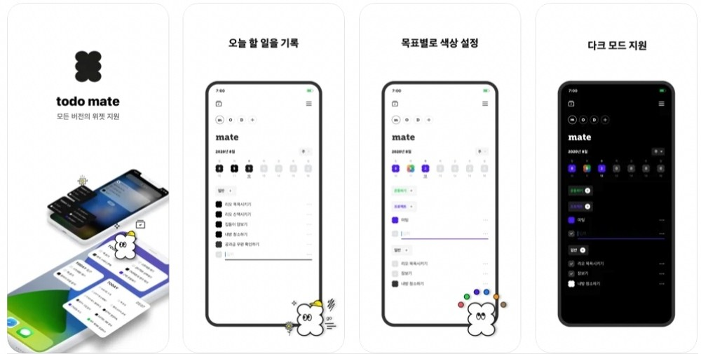
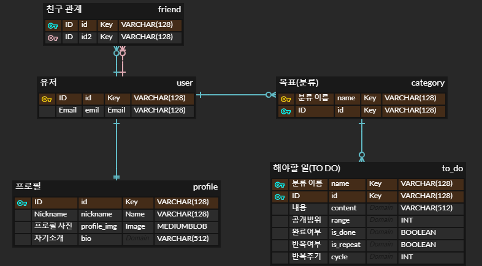
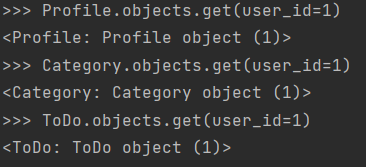
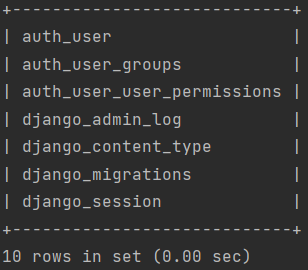

# CEOS 16기 백엔드 스터디 모델링 및 drf 연습을 위한 레포


## 2주차 미션: DB 모델링 및 Django ORM

### 투두메이트 서비스 설명


#### 오늘 해야 할 일을 기록하고, 친구들과 공유함으로써 더욱 동기를 부여하는 서비스
- 해야 할 일을 **자신의 분류(목표)별**로 나눠서 기록할 수 있음
- **분류(목표)별로 색**을 지정할 수 있음. 할 일을 완료하면 분류에 맞는 색이 채워져서 **채우는 재미**가 있음
- 매일 하는 일 등 **반복적으로 하는 일**에 대해서도 따로 **간편하게 설정 가능**
- **오늘의 일기**도 간략하게 기록할 수 있음 (기분도 이모지로 기록 가능)
- 친구와 함께 투두를 공유함으로써 **서로 동기부여**도 하고, 친구의 할일을 **응원하는** 이모지 기능도 있음

<br></br>

### 투두메이트 모델링 결과

1. 유저는 목표를 여러 개 세울 수 있다. (1 : N)
2. 유저는 할 일을 여러 개 만들 수 있다. (1 : N)
3. 목표는 할 일을 여러 개 가질 수 있다. 하나의 할 일은 한 목표에 대응된다. (1 : N)
4. 친구 관계 (1 : N)


<br></br>

### ORM 이용해보기

- 파이썬 쉘 들어가기
```shell
python manage.py shell
```

1. **데이터베이스에 해당 모델 객체 3개 넣기**
```shell
>>> from api.models import *
>>> from auth.models import *
>>> user = User.objects.create()
>>> user.save()
>>> user = Profile.objects.create(nickname='ori', bio='hello', user_id=1) 
>>> user.save()
>>> category = Category.objects.create(user_id=1, name='homework')
>>> category.save()
>>> todo = ToDo.objects.create(user_id=1, category_id=1, content='coding', is_done=False, is_repeat=False)
>>> todo.save()

```

2. **삽입한 객체들을 쿼리셋으로 조회해보기 (단, 객체들이 객체의 특성을 나타내는 구분가능한 이름으로 보여야 함)**

3. **filter 함수 사용해보기**


<br></br>

### 새롭게 알게된 점

- `TextField()` 와 `CharField()` 의 차이
</br>: 최대 길이의 정의가 필요할 경우 주로 CharField() 사용

- 장고는 모델에서 기본 키 자동으로 만들어 준다.
- 같은 테이블에서 외래키로 가져올 시, `related_name=''` 설정을 꼭 해줘야 한다
- 모델 설정 시, db 관계를 명령어를 통해 쉽게 설정할 수 있음 (`OneToOneField`, `ManyToManyField`, ...)
<br></br>

### 회고

1주차 때는 문서를 따라하며 예제를 해서 확 와닿지 않았는데, 이번에 직접 모델링도 해보며 장고에서 모델을 어떻게 사용하는지 확 와닿은 것 같다!!

그런데 아직 구글링 없이는 코드를 못짜겠어서 훨씬 더 공부를 많이 해야겠다.. 💪💪🔥🔥

그리고 node에서는 ORM을 사용할 때 설정해줘야 하는 게 더 많은 느낌인데 장고는 ORM이 아예 내장(?) 된 느낌이라 훨씬 편한 것 같다 ✨

<br></br>

### 더 알아보고 싶은 것

- migrate 했을 시 생기는 장고 관련 테이블에 대해 <br></br>


- 기본 키 자동으로 만드는 거 커스텀 할 수 있는지에 대해