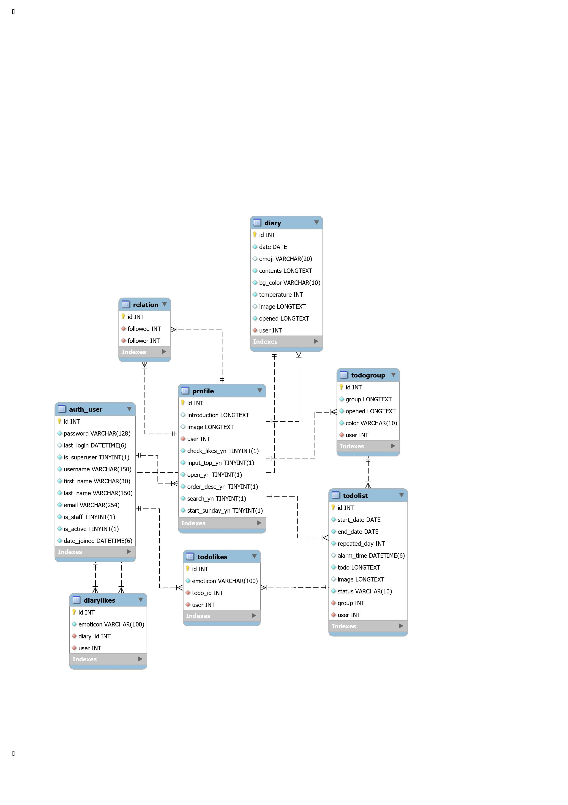
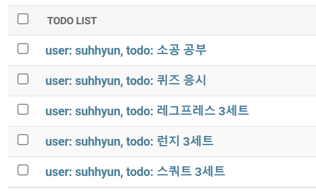

# 2022.09.30
## TODOMATE FEATURES 
    1. 할 일 정리
    - 목표라는 큰 그룹 안에 할 일 목록들이 존재 
    - 각 목표는 유저, 공개 여부, 색상에 대한 정보를 필수로 포함
    - 각 목록은 유저, 그룹, 상태(완료, 미완료, 보관), 시작 및 종료 날짜, 반복 요일, 설명에 대한 정보들을 필수로 포함
    - 각 목록은 인증 이미지, 알림 시간을 포함 가능

    2. 일기 작성
    - 사용자는 날짜별로 일기 작성 가능
    - 각 일기는 유저, 날짜, 이모지, 내용, 배경 색상, 온도, 공개 여부에 대한 정보를 필수로 포함
    - 각 일기는 이미지 파일을 포함 가능
    
    3. 상호작용
    - 팔로워, 팔로잉 기능
    - 팔로워 목표 보기 가능 
    - 팔로워가 완료한 목록에 이모지 달기

    4. 유저 관리
    - 유저는 이메일, 비밀번호, 이름을 필수로 포함
    - 유저는 자기소개, 프로필 사진을 포함 가능
    - 유저는 공개 여부와 화면 구성에 대해서 설정할 수 있다

## 작성한 모델
<pre><code>Profile : 유저의 정보 저장
TodoGrou : 목표에 대한 정보 저장
TodoList : 할 일 목록에 대한 정보 저장 
LikedList : 하트를 누른 할 일 목록들을 저장 
Diary : 작성한 일기에 대한 정보 저장
Relation : 팔로잉/팔로워에 대한 정보 저장 
</code></pre>

## ORM 이용해보기
1. 데이터베이스에 해당 모델 객체 3개 넣기
<pre><code>from api.models import *

# Todolist를 생성하기 위해 user 먼저 생성
User.objects.create(username='suhhyun',email='example@gmail.com',password='pwpw1234!')
Profile.objects.create(user=User.objects.get(username='suhhyun'),introduction='Hi, my name is Soohyeon Choi!')
user_1 = Profile.objects.get(user=User.objects.get(username='suhhyun'))

# Todolist가 저장될 그룹 생성
group_1 = TodoGroup.objects.create(user=user_1,group='운동')
group_2 = TodoGroup.objects.create(user=user_1,group='공부')

# Todolist 객체 생성
TodoList.objects.create(user=user_1,group=group_1,todo='스쿼트 3세트')
TodoList.objects.create(user=user_1,group=group_1,todo='런지 3세트')
TodoList.objects.create(user=user_1,group=group_1,todo='레그프레스 3세트')
TodoList.objects.create(user=user_1,group=group_2,todo='퀴즈 응시')
</code></pre>
2. 삽입한 객체들을 쿼리셋으로 조회해보기 (단, 객체들이 객체의 특성을 나타내는 구분가능한 이름으로 보여야 함)
<pre><code>TodoList.objects.all()
>>> < QuerySet [< TodoList: user: suhhyun, todo: 스쿼트 3세트>, < TodoList: user: suhhyun, todo: 런지 3세트>, < TodoList: user: suhhyun, todo: 레그프레스 3세트>, < TodoList: user: suhhyun, todo: 퀴즈 응시>]>
</code></pre>
3. filter 함수 사용해보기
<pre><code>TodoList.objects.filter(group=TodoGroup.objects.get(group='운동'))
>>> < QuerySet [< TodoList: user: suhhyun, todo: 스쿼트 3세트>, < TodoList: user: suhhyun, todo: 런지 3세트>, < TodoList: user: suhhyun, todo: 레그프레스 3세트>]>
</code></pre>

## !NEW!
1. CharField vs TextField : max 길이를 정해놓을 때는 CharField를, 가변 길이의 텍스트를 저장할 때는 TextField를 사용한다. 글 제목과 같은 짧은 텍스트는 Char, 글 내용 같은 긴 텍스트는 Text에 저장하면 좋을 듯 하다.   
2. Meta class : 작성한 모델의 속성을 관리하는 클래스라고 이해함
   1. db_class : 기본으로 모델 명은 appname_modelname으로 구성된다고 함. 이를 재설정해주기 위해 작성
   2. verbose_name : admin 페이지에서 모델을 관리할 때 표기되는 이름을 관리하는 것 같음. 사용할 일은 별로 없을 것 같음   
3. related_name : Foreign Key Field와 함께 작성해주면 나중에 코드를 더 직관적으로 작성 가능. 장고 ORM으로 언급하지 않을 것 같은 필드는 related_name을 따로 설정해주지 않음.   
4. db_column : db 테이블에 저장될 column 명을 지정. FK에 _id가 붙는 것이 신경쓰여서 사용했는데 붙는게 나을지도  
5. setting 관련 에러 : python console에서 setting 파일을 제대로 찾지 못해서 에러가 생김. 아래 경로에서 코드 추가해서 해결
<pre><code># File>Settings>Build, Execution, Deployment>Console>Django Console

import sys, <u>os</u>; print('Python %s on %s' % (sys.version, sys.platform))
import django; print('Django %s' % django.get_version())
sys.path.extend([WORKING_DIR_AND_PYTHON_PATHS])
<u>os.environ.setdefault('DJANGO_SETTINGS_MODULE', 'django_rest_framework_16th.settings')</u>
if 'setup' in dir(django): django.setup()
import django_manage_shell; django_manage_shell.run(PROJECT_ROOT)</code></pre>
## !WONDER!
1. 일정한 요일마다 반복되는 todolist를 효율적으로 관리하는 방법?
   1. repeated_mon, repeated_tue... 등 BooleanField를 7개 만들기
   2. 텍스트 그대로 TextField에 저장하기 (ex.월,수,금 or mon,wed,fri) 
   3. 이진수로 가정하고 IntegerField에 저장하기 (ex. 월수금 > 1010100) 
   
   >i는 필드가 너무 많아지는 게 불편하고 ii는 그냥 맘에 안듦. 결국 iii번으로 결정했는데 그닥 직관적이지 않은 것 같아서 고민 중....
   

## 회고...
장고 모델 생성과 ORM에 대해서 어느 정도 알고 있다고 생각했었는데 아니었다. FK를 설정하며 나온 수많은 에러를 해결하며 모델 및 데이터베이스 설계에 대해 많이 배운 것 같다.

# 2022.10.08
## 과제
1. 모델 선택 및 데이터 삽입
<pre><code> # models.py

class TodoList(models.Model):
    user = models.ForeignKey(Profile, db_column='user', on_delete=models.CASCADE)
    group = models.ForeignKey(TodoGroup, related_name='list', db_column='group', on_delete=models.CASCADE)
    start_date = models.DateField(default=timezone.now)
    end_date = models.DateField(default=timezone.now)
    repeated_day = models.IntegerField(default=1111111)
    alarm_time = models.DateTimeField(null=True)
    todo = models.TextField()
    image = models.TextField(null=True)
    status = models.CharField(max_length=10, default='not done')</code></pre>
    

2. 모든 데이터를 가져오는 API
   - URL : api/todolists
   - Method : GET
<pre><code>[
    {
        "user": 1,
        "group": 1,
        "start_date": "2022-10-01",
        "end_date": "2022-10-01",
        "repeated_day": 1111111,
        "alarm_time": null,
        "todo": "스쿼트 3세트",
        "status": "not done"
    },
    {
        "user": 1,
        "group": 1,
        "start_date": "2022-10-01",
        "end_date": "2022-10-01",
        "repeated_day": 1111111,
        "alarm_time": null,
        "todo": "런지 3세트",
        "status": "not done"
    },
    {
        "user": 1,
        "group": 1,
        "start_date": "2022-10-01",
        "end_date": "2022-10-01",
        "repeated_day": 1111111,
        "alarm_time": null,
        "todo": "레그프레스 3세트",
        "status": "not done"
    },
    {
        "user": 1,
        "group": 3,
        "start_date": "2022-10-01",
        "end_date": "2022-10-01",
        "repeated_day": 1111111,
        "alarm_time": null,
        "todo": "퀴즈 응시",
        "status": "not done"
    },
    {
        "user": 1,
        "group": 3,
        "start_date": "2022-10-07",
        "end_date": "2022-10-07",
        "repeated_day": 1111111,
        "alarm_time": null,
        "todo": "소공 공부",
        "status": "not done"
    }
]</code></pre>

3. 특정 데이터를 가져오는 API
   - URL : api/todolist/4
   - Method : GET
<pre><code>{
    "user": 1,
    "group": 1,
    "start_date": "2022-10-01",
    "end_date": "2022-10-01",
    "repeated_day": 1111111,
    "alarm_time": null,
    "todo": "스쿼트 3세트",
    "status": "not done"
}</code></pre>

4. 새로운 데이터를 create하도록 요청하는 API
   - URL : api/todolist
   - Method : POST
   - body
<pre><code>{
    "user":1,
    "group":3,
    "start_date": "2022-10-08",
    "end_date": "2022-10-10",
    "todo": "소프트웨어공학 pdf 요약"
}</code></pre>

<pre><code>{
    "user": 1,
    "group": 3,
    "start_date": "2022-10-08",
    "end_date": "2022-10-10",
    "repeated_day": 1111111,
    "alarm_time": null,
    "todo": "소프트웨어공학 pdf 요약",
    "status": "not done"
}</code></pre>

## !NEW!
1. serializer : query object를 Json 형태로 리턴해주기 위해서 사용
OnetoOneField로 연결된 User 모델은 import 후에 UserSerializer 작성함
<pre><code>from django.contrib.auth.models import User</code></pre>
2. 한글 깨짐 : 리턴한 값이 Web에서는 이상한 문자로 표현됨. JsonResponse의 인자로 json_dumps_params={'ensure_ascii': False}를 추가해서 해결

## !WONDER!
1. 이전 클래스형 뷰에서 POST method를 사용했을 때는 request.data로 데이터를 받아왔는데 이번 과제를 할 때는 저 코드를 인식하지를 못했다. 클래스형 뷰와 함수형 뷰의 작동 방식의 차이 때문에 그런 것 같은데 자세한건 시험이 끝난 후 찾아볼 예정....
2. status : 200, 201, 409, 500... 어떨 때 어떤 status를 사용하는지 다 외워야되나..? 
3. serializer가 여러개의 객체를 반환할 때는 Dictinary 타입이 아니라 List 타입으로 반환해준다. 이것 때문에 계속 오류가 나서 JsonResponse에 safe=False 인자를 추가하는 것으로 해결하기는 했는데 뭔가 찝찝하다... 다른 방법이 있는지 더 알아볼 예정
4. created_at, deleted_at, updated_at 필드의 필요성 : created_at은 date가 역할을 대신해주고 있고 updated_at은 필요성을 느끼지 못했다. deleted_at은 DB에서 데이터를 직접 삭제하는 것보다는 남겨두는 것이 낫다라는 말을 듣기는 했지만, 그럼 삭제되지 않은 리스트를 불러올 때마다 deleted_at=false 조건을 확인할 생각을 하니 너무 귀찮을 것 같아서 넣지 않았는데... 관련해서 더 찾아볼 예정
5. api/items vs api/items/ : url 끝에 /가 없는 편이 더 깔끔하다고 생각하기는 했는데 역할에 차이가 있는지 더 알아볼 예정....

## 회고...
이전에는 직접 json 형태로 반환해주는 form을 만들어서 쫌쫌따리 반환했는데 serializer를 알게되었다.
클래스형 뷰로 코드를 리팩토링 하면서 URL에 알맞게 GET, POST 함수들의 위치를 조정할 예정이다.
