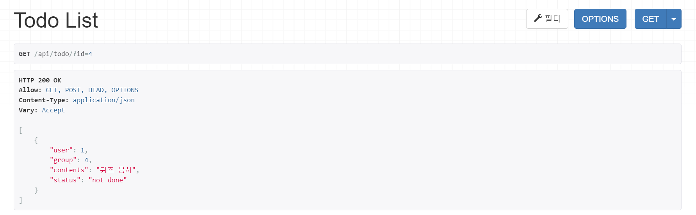
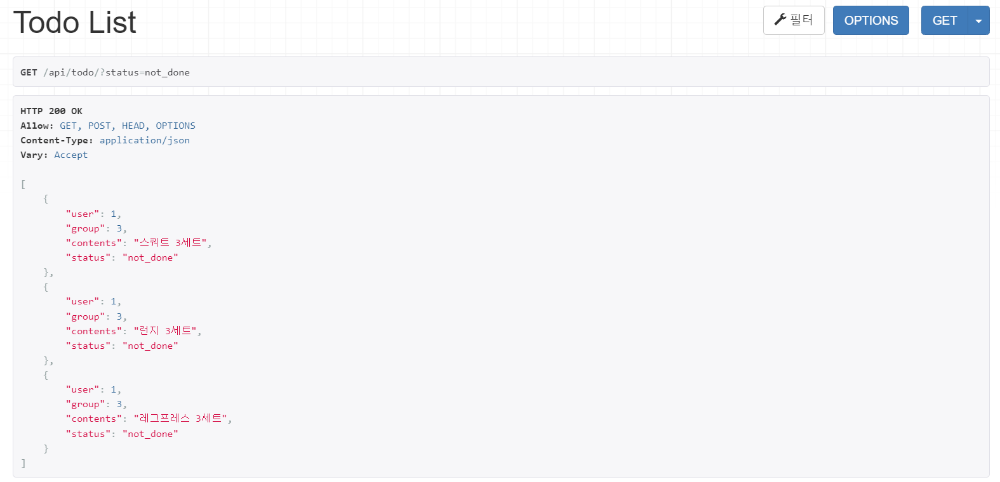
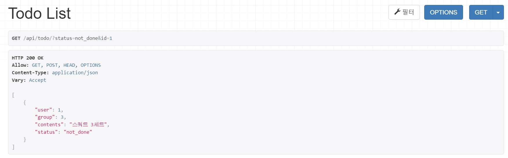
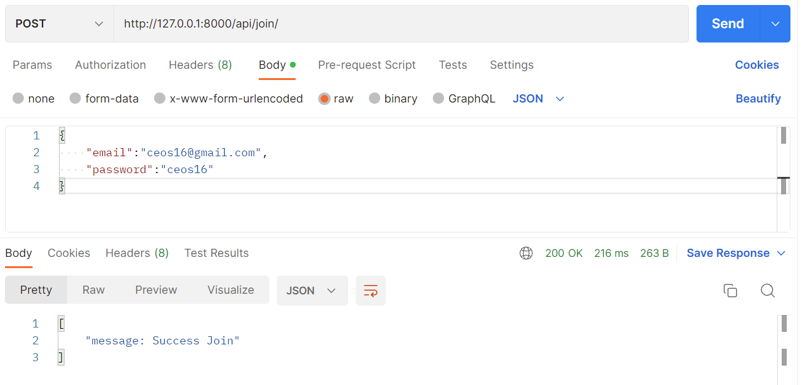
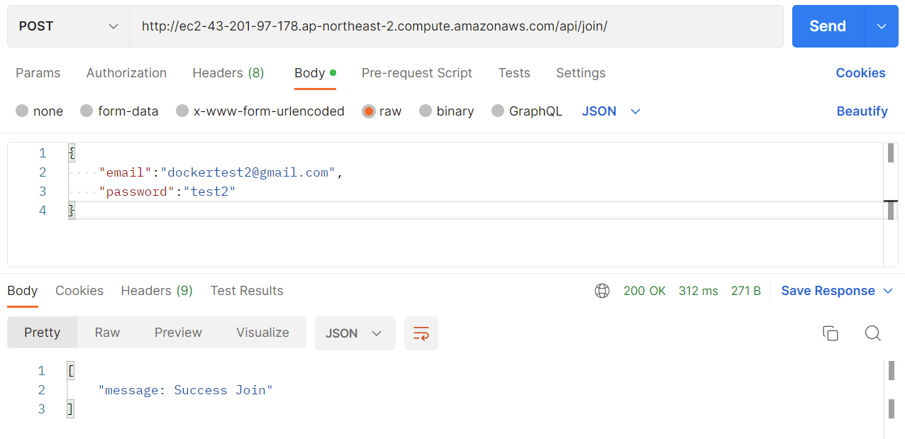
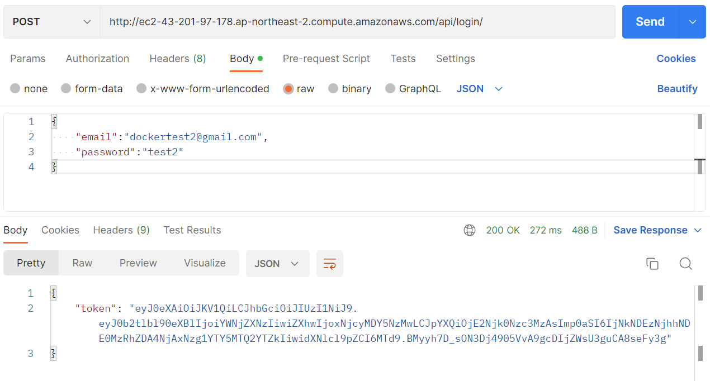

# 2022.09.30
## TODOMATE FEATURES 
    1. 할 일 정리
    - 목표라는 큰 그룹 안에 할 일 목록들이 존재 
    - 각 목표는 유저, 공개 여부, 색상에 대한 정보를 필수로 포함
    - 각 목록은 유저, 그룹, 상태(완료, 미완료, 보관), 시작 및 종료 날짜, 반복 요일, 설명에 대한 정보들을 필수로 포함
    - 각 목록은 인증 이미지, 알림 시간을 포함 가능

    2. 일기 작성
    - 사용자는 날짜별로 일기 작성 가능
    - 각 일기는 유저, 날짜, 이모지, 내용, 배경 색상, 온도, 공개 여부에 대한 정보를 필수로 포함
    - 각 일기는 이미지 파일을 포함 가능
    
    3. 상호작용
    - 팔로워, 팔로잉 기능
    - 팔로워 목표 보기 가능 
    - 팔로워가 완료한 목록에 이모지 달기

    4. 유저 관리
    - 유저는 이메일, 비밀번호, 이름을 필수로 포함
    - 유저는 자기소개, 프로필 사진을 포함 가능
    - 유저는 공개 여부와 화면 구성에 대해서 설정할 수 있다

## 작성한 모델
<pre><code>Profile : 유저의 정보 저장
TodoGrou : 목표에 대한 정보 저장
TodoList : 할 일 목록에 대한 정보 저장 
LikedList : 하트를 누른 할 일 목록들을 저장 
Diary : 작성한 일기에 대한 정보 저장
Relation : 팔로잉/팔로워에 대한 정보 저장 
</code></pre>

## ORM 이용해보기
1. 데이터베이스에 해당 모델 객체 3개 넣기
<pre><code>from api.models import *

# Todolist를 생성하기 위해 user 먼저 생성
User.objects.create(username='suhhyun',email='example@gmail.com',password='pwpw1234!')
Profile.objects.create(user=User.objects.get(username='suhhyun'),introduction='Hi, my name is Soohyeon Choi!')
user_1 = Profile.objects.get(user=User.objects.get(username='suhhyun'))

# Todolist가 저장될 그룹 생성
group_1 = TodoGroup.objects.create(user=user_1,group='운동')
group_2 = TodoGroup.objects.create(user=user_1,group='공부')

# Todolist 객체 생성
TodoList.objects.create(user=user_1,group=group_1,todo='스쿼트 3세트')
TodoList.objects.create(user=user_1,group=group_1,todo='런지 3세트')
TodoList.objects.create(user=user_1,group=group_1,todo='레그프레스 3세트')
TodoList.objects.create(user=user_1,group=group_2,todo='퀴즈 응시')
</code></pre>
2. 삽입한 객체들을 쿼리셋으로 조회해보기 (단, 객체들이 객체의 특성을 나타내는 구분가능한 이름으로 보여야 함)
<pre><code>TodoList.objects.all()
>>> < QuerySet [< TodoList: user: suhhyun, todo: 스쿼트 3세트>, < TodoList: user: suhhyun, todo: 런지 3세트>, < TodoList: user: suhhyun, todo: 레그프레스 3세트>, < TodoList: user: suhhyun, todo: 퀴즈 응시>]>
</code></pre>
3. filter 함수 사용해보기
<pre><code>TodoList.objects.filter(group=TodoGroup.objects.get(group='운동'))
>>> < QuerySet [< TodoList: user: suhhyun, todo: 스쿼트 3세트>, < TodoList: user: suhhyun, todo: 런지 3세트>, < TodoList: user: suhhyun, todo: 레그프레스 3세트>]>
</code></pre>

## !NEW!
1. CharField vs TextField : max 길이를 정해놓을 때는 CharField를, 가변 길이의 텍스트를 저장할 때는 TextField를 사용한다. 글 제목과 같은 짧은 텍스트는 Char, 글 내용 같은 긴 텍스트는 Text에 저장하면 좋을 듯 하다.   
2. Meta class : 작성한 모델의 속성을 관리하는 클래스라고 이해함
   1. db_class : 기본으로 모델 명은 appname_modelname으로 구성된다고 함. 이를 재설정해주기 위해 작성
   2. verbose_name : admin 페이지에서 모델을 관리할 때 표기되는 이름을 관리하는 것 같음. 사용할 일은 별로 없을 것 같음   
3. related_name : Foreign Key Field와 함께 작성해주면 나중에 코드를 더 직관적으로 작성 가능. 장고 ORM으로 언급하지 않을 것 같은 필드는 related_name을 따로 설정해주지 않음.   
4. db_column : db 테이블에 저장될 column 명을 지정. FK에 _id가 붙는 것이 신경쓰여서 사용했는데 붙는게 나을지도  
5. setting 관련 에러 : python console에서 setting 파일을 제대로 찾지 못해서 에러가 생김. 아래 경로에서 코드 추가해서 해결
<pre><code># File>Settings>Build, Execution, Deployment>Console>Django Console

import sys, <u>os</u>; print('Python %s on %s' % (sys.version, sys.platform))
import django; print('Django %s' % django.get_version())
sys.path.extend([WORKING_DIR_AND_PYTHON_PATHS])
<u>os.environ.setdefault('DJANGO_SETTINGS_MODULE', 'django_rest_framework_16th.settings')</u>
if 'setup' in dir(django): django.setup()
import django_manage_shell; django_manage_shell.run(PROJECT_ROOT)</code></pre>
## !WONDER!
1. 일정한 요일마다 반복되는 todolist를 효율적으로 관리하는 방법?
   1. repeated_mon, repeated_tue... 등 BooleanField를 7개 만들기
   2. 텍스트 그대로 TextField에 저장하기 (ex.월,수,금 or mon,wed,fri) 
   3. 이진수로 가정하고 IntegerField에 저장하기 (ex. 월수금 > 1010100) 
   
   >i는 필드가 너무 많아지는 게 불편하고 ii는 그냥 맘에 안듦. 결국 iii번으로 결정했는데 그닥 직관적이지 않은 것 같아서 고민 중....
   

## 회고...
장고 모델 생성과 ORM에 대해서 어느 정도 알고 있다고 생각했었는데 아니었다. FK를 설정하며 나온 수많은 에러를 해결하며 모델 및 데이터베이스 설계에 대해 많이 배운 것 같다.

# 2022.10.08
## 과제
1. 모델 선택 및 데이터 삽입
<pre><code> # models.py

class TodoList(models.Model):
    user = models.ForeignKey(Profile, db_column='user', on_delete=models.CASCADE)
    group = models.ForeignKey(TodoGroup, related_name='list', db_column='group', on_delete=models.CASCADE)
    start_date = models.DateField(default=timezone.now)
    end_date = models.DateField(default=timezone.now)
    repeated_day = models.IntegerField(default=1111111)
    alarm_time = models.DateTimeField(null=True)
    todo = models.TextField()
    image = models.TextField(null=True)
    status = models.CharField(max_length=10, default='not done')</code></pre>
    

2. 모든 데이터를 가져오는 API
   - URL : api/todolists
   - Method : GET
<pre><code>[
    {
        "user": 1,
        "group": 1,
        "start_date": "2022-10-01",
        "end_date": "2022-10-01",
        "repeated_day": 1111111,
        "alarm_time": null,
        "todo": "스쿼트 3세트",
        "status": "not done"
    },
    {
        "user": 1,
        "group": 1,
        "start_date": "2022-10-01",
        "end_date": "2022-10-01",
        "repeated_day": 1111111,
        "alarm_time": null,
        "todo": "런지 3세트",
        "status": "not done"
    },
    {
        "user": 1,
        "group": 1,
        "start_date": "2022-10-01",
        "end_date": "2022-10-01",
        "repeated_day": 1111111,
        "alarm_time": null,
        "todo": "레그프레스 3세트",
        "status": "not done"
    },
    {
        "user": 1,
        "group": 3,
        "start_date": "2022-10-01",
        "end_date": "2022-10-01",
        "repeated_day": 1111111,
        "alarm_time": null,
        "todo": "퀴즈 응시",
        "status": "not done"
    },
    {
        "user": 1,
        "group": 3,
        "start_date": "2022-10-07",
        "end_date": "2022-10-07",
        "repeated_day": 1111111,
        "alarm_time": null,
        "todo": "소공 공부",
        "status": "not done"
    }
]</code></pre>

3. 특정 데이터를 가져오는 API
   - URL : api/todolist/4
   - Method : GET
<pre><code>{
    "user": 1,
    "group": 1,
    "start_date": "2022-10-01",
    "end_date": "2022-10-01",
    "repeated_day": 1111111,
    "alarm_time": null,
    "todo": "스쿼트 3세트",
    "status": "not done"
}</code></pre>

4. 새로운 데이터를 create하도록 요청하는 API
   - URL : api/todolist
   - Method : POST
   - body
<pre><code>{
    "user":1,
    "group":3,
    "start_date": "2022-10-08",
    "end_date": "2022-10-10",
    "todo": "소프트웨어공학 pdf 요약"
}</code></pre>

<pre><code>{
    "user": 1,
    "group": 3,
    "start_date": "2022-10-08",
    "end_date": "2022-10-10",
    "repeated_day": 1111111,
    "alarm_time": null,
    "todo": "소프트웨어공학 pdf 요약",
    "status": "not done"
}</code></pre>

## !NEW!
1. serializer : query object를 Json 형태로 리턴해주기 위해서 사용
OnetoOneField로 연결된 User 모델은 import 후에 UserSerializer 작성함
<pre><code>from django.contrib.auth.models import User</code></pre>
2. 한글 깨짐 : 리턴한 값이 Web에서는 이상한 문자로 표현됨. JsonResponse의 인자로 json_dumps_params={'ensure_ascii': False}를 추가해서 해결

## !WONDER!
1. 이전 클래스형 뷰에서 POST method를 사용했을 때는 request.data로 데이터를 받아왔는데 이번 과제를 할 때는 저 코드를 인식하지를 못했다. 클래스형 뷰와 함수형 뷰의 작동 방식의 차이 때문에 그런 것 같은데 자세한건 시험이 끝난 후 찾아볼 예정....
2. status : 200, 201, 409, 500... 어떨 때 어떤 status를 사용하는지 다 외워야되나..? 
3. serializer가 여러개의 객체를 반환할 때는 Dictinary 타입이 아니라 List 타입으로 반환해준다. 이것 때문에 계속 오류가 나서 JsonResponse에 safe=False 인자를 추가하는 것으로 해결하기는 했는데 뭔가 찝찝하다... 다른 방법이 있는지 더 알아볼 예정
4. created_at, deleted_at, updated_at 필드의 필요성 : created_at은 date가 역할을 대신해주고 있고 updated_at은 필요성을 느끼지 못했다. deleted_at은 DB에서 데이터를 직접 삭제하는 것보다는 남겨두는 것이 낫다라는 말을 듣기는 했지만, 그럼 삭제되지 않은 리스트를 불러올 때마다 deleted_at=false 조건을 확인할 생각을 하니 너무 귀찮을 것 같아서 넣지 않았는데... 관련해서 더 찾아볼 예정
5. api/items vs api/items/ : url 끝에 /가 없는 편이 더 깔끔하다고 생각하기는 했는데 역할에 차이가 있는지 더 알아볼 예정....

## 회고...
이전에는 직접 json 형태로 반환해주는 form을 만들어서 쫌쫌따리 반환했는데 serializer를 알게되었다.
클래스형 뷰로 코드를 리팩토링 하면서 URL에 알맞게 GET, POST 함수들의 위치를 조정할 예정이다.

# 2022.11.12
## 과제
1. CBV로 리팩토링
<pre><code># views.py

class TodosView(APIView):
    # noinspection PyMethodMayBeStatic
    def get(self, request):
        try:
            lists = Todo.objects.all()
            serializer = TodoSerializer(lists, many=True)
            return Response(serializer.data)
        except AttributeError as e:
            print(e)
            return Response("message: no data")</code></pre>

2. Viewset으로 리팩토링
<pre><code># views.py

class TodoViewSet(viewsets.ModelViewSet):
    serializer_class = TodoSerializer
    queryset = Todo.objects.all()
    filter_backends = [DjangoFilterBackend]
    filterset_class = TodoFilter</code></pre>
<pre><code># urls.py

from rest_framework import routers
from .views import TodoViewSet

router = routers.DefaultRouter()
router.register(r'todo', TodoViewSet)

urlpatterns = router.urls</code></pre>

3. filter 기능 구현
<pre><code># views.py

class TodoFilter(FilterSet):
    id = filters.NumberFilter(field_name='id', lookup_expr='iexact')
    contents = filters.CharFilter(field_name='contents', lookup_expr='contains')
    group = filters.NumberFilter(method='filter_group_notDone')

    class Meta:
        model = Todo
        fields = ['id', 'contents', 'group']

    def filter_group_notDone(self, queryset, group, value):
        queryset = Todo.objects.all()
        filtered_queryset = queryset.filter(group=value, status='not_done')
        return filtered_queryset
</code></pre>

## !Done! 
1. Add BaseModel
2. Rename model and field
3. Add Viewset
4. Add Filterset

## !NEW! = !WONDER!
1. Viewset : 여러가지 url과 그 작동에 대해서 알아서 처리해주는 기능이라고 대충 이해하고 있다... 굉장히 편하다는 것은 알겠는데 작동 원리를 전혀 이해하지 못했다... 일단 과제 내고 더 찾아볼 예정
2. Filterset
   1. filterset_fields : View Class 내부에서 사용, 일치여부를 확인하고 싶은 경우에 사용
   2. filterset : Filter Class 내부에서 사용
   3. filterset_method : 반환된 queryset으로 추가적인 질의를 하고싶은 경우

## 회고...
열심히 CBV로 코드 작성하고 너무 뿌듯했는데 Viewset으로 고치는 과정에서,, 굉장히 허탈했다.
코드 몇줄로 지금까지 작성한 기능을 다 대체할 수 있다니.. 근데 생각할수록 너무 편리한 것 같다
특히 Filterset  ( ･ᴗ･̥̥̥ )... 과제를 하면 할수록 공식문서의 중요성을 느낀다
아무튼 장고가 조금 더 좋아졌다.

# 2022.11.19
## 과제
1. 로그인 인증 방식
   1. Cookie : 브라우저에 설치
   2. Session : 서버에 저장
   3. Token : 클라이언트에 저장

2. JWT란 : JSON Web Token, Header, Payload, Signature로 이루어져있으며 각각은 Base64Url로 인코딩됨

3. JWT 로그인 구현
   1. 커스텀 User 모델 사용
   - email로 유저 식별

   <pre><code># models.py

   class MyUser(AbstractBaseUser):
       email = models.EmailField(max_length=255, unique=True)
       nickname = models.CharField(max_length=20, default='me')
       image = models.TextField(null=True)
       
       search_yn = models.BooleanField(default=True)
       open_yn = models.BooleanField(default=True)
       start_sunday_yn = models.BooleanField(default=False)
       order_desc_yn = models.BooleanField(default=True)
       input_top_yn = models.BooleanField(default=False)
       check_likes_yn = models.BooleanField(default=True)

       is_active = models.BooleanField(default=True)
       is_admin = models.BooleanField(default=False)
   
       objects = UserManager()
   
       USERNAME_FIELD = 'email'
   
       class Meta:
           db_table = "MyUser"
   
       def __str__(self):
           return self.email
   
       def get_nickname(self):
           return self.nickname

   </code></pre>
   
   2. 로그인 구현
      - Form 생성
      <pre><code> # admin.py

      class UserCreationForm(forms.ModelForm):
         email = forms.EmailField(label='email', required=True, widget=forms.EmailInput)
         nickname = forms.CharField(label='nickname', required=False, widget=forms.TextInput)
         password = forms.CharField(label='Password', widget=forms.PasswordInput)
      
         class Meta:
             model = MyUser
             fields = ('email', 'nickname')
            
         # nickname default값 처리, nickname 인자가 들어오지 않으면 default값으로 저장
         def clean_nickname(self):
             nickname = self.cleaned_data.get("nickname")
   
             if nickname is None:
                 return self.cleaned_data.initial
             return nickname
      
         def save(self, commit=True):
            user = super(UserCreationForm, self).save(commit=False)
            user.set_password(self.cleaned_data["password"])
            if commit:
               user.save()
            return user
   </code></pre>

   (회원가입)
   <pre><code># views.py

    class JoinView(APIView):
    # noinspection PyMethodMayBeStatic
    def post(self, request):
        form = UserCreationForm(request.data)
        if form.is_valid():
            user = form.save()
            user.nickname = form.clean_nickname()

            return Response({"message: Success Join"})

        else:
            return Response(form.errors)
   </code></pre>
   
   (로그인)
   <pre><code># views.py

   class JoinView(APIView):
    # noinspection PyMethodMayBeStatic
    def post(self, request):
        form = UserCreationForm(request.data)
        if form.is_valid():
            user = form.save()
            user.nickname = form.clean_nickname()

            return Response({"message: Success Join"})

        else:
            return Response(form.errors)
   </code></pre>
      

# !NEW!
1. JWT
2. Form : request로 받는 데이터를 검증된 형태로 리턴?.?
3. ChoiceField로 리팩토링

# 회고...
jwt를 새로 배우게되면서 이전까지 얼마나 용감하게 코딩했는지를 알게되었다. 나는 지금까지 항상 payload에 사용자 정보를 함께 보내줬었는데ㅎㅎ.....
이번 과제는 Custom model, Form 등 새로운 걸 너무 많이 나와서 어려웠다.

어떻게 잘 얼기설기 코드를 작성하기는 했는데 위와 같은 상태이다. 이전에 배운 ViewSet도 활용하고 뭔가 더 깔끔하고 효율적으로 고치고 싶었는데 지금은 너무 낡고 지쳐서 다음에 다시 조금 고쳐볼 예정이다.
refreshtoken 관련해서 코드를 추가하기는 했는데 작동 확인을 하지 못했다. 마찬가지로 다음에 다시 확인해볼 예정이다.

# 2022.11.19
## 과제
1. Postman 요청

# 회고...
1. Pillow error 
<pre><code>ERROR: Pillow-9.3.0-cp38-cp38-musllinux_1_1_x86_64.whl is not a supported wheel on this platform.</code></pre>
git action에서 계속 오류가 발생했다. 
<pre><code># Dockerfile.prod

FROM python:3.9.7-alpine as builder
RUN pip install --upgrade pip</code></pre>

이 두 줄을 추가하면서 해결했다. 사실 검색으로는 python 3.9와 Pillow 9.3.0이 호환된다고 하고 pip도 warning만 뜨는데 왜 저거때문에 에러가 났는지 모르겠다
2. Internal Sever Error 500 
Debug=True를 Git Secret에 추가한 후에야 정확한 이유를 알 수 있었다. 심지어 처음에는 Debug=True를 적용하고 싶어서 base.py 파일만 계속 수정했다.... 
  아무튼 rds에 연결한 데이터베이스에 스키마와 테이블이 존재하지 않아서 발생하는 에러였다ㅜ.ㅜ
처음에는 entrypoint.prod.sh에 migration 관련 코드를 추가했으나 적용되지 않아서 결국 data export/import 작업을 통해 테이블을 통째로 옮겼고 에러를 해결할 수 있었다. 제대로 해결한 건 아니라서 너무 찝찝하긴 한데 어쩔 수 없다. 다음에 시간 나면 고칠 것.
3. EC2 
어느 순간부터 git action을 실행하면 서버가 멈춰버렸다. 뭔가 불안해서 htop 명령어로 리소스 사용량을 보니 CPU 사용량이 너무 많아서 서버가 다운된 것이었다.. 이것 때문에 계속 ec2 서버를 재시작하다가 결국 push 전에 <pre><code>sudo docker rm -f $(sudo docker ps -qa)</pre></code>를 실행해서 docker를 종료시키고 git action을 실행했다. 프리티어 문제라서 내가 고칠 수 있는 부분이 아닌 것 같다.

++ 생각해보니까 docker-compose.prod.yml 파일에 <pre><code>  db:
    container_name: db
    image: mysql:5.7
    restart: always
    environment:
      MYSQL_ROOT_HOST: '%'
      MYSQL_ROOT_PASSWORD: mysql
    expose:
      - 3306
    ports:
      - "3307:3306"
    env_file:
      - .env
    volumes:
      - dbdata:/var/lib/mysql</code></pre> 를 추가했는데 이것때문에 CPU 사용량이 많아진 것 같다. 근데 Internal Server Error를 해결할 수 있었던게 이 코드를 추가해서인지 아니면 rds와 연결된 db에 테이블들을 추가해서인지를 모르겠다. 시험이 끝나고 다시 시도할 예정이다.🥹🥹🥹   
ec2, rds를 사용해 본 적이 있어서 쉬울 것이라고 예상했는데 생각보다 에러가 너무너무 많이 났고 어려웠다. 처음에는 dockerfile과 dockerfile.prod의 차이도 몰라서 계속 이상한 파일을 수정하기도 했다. 그래도 지금은 postman이 정상적으로 작동한 것만으로도 감동스럽다