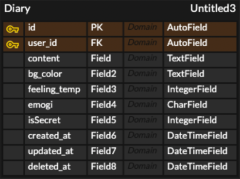

# TODOMATE 데이터 모델링

## TODOMATE란?
> TodoMate (투두메이트)는 일상을 기록하며, 지인과 일정을 공유할 수 있도록 만든 앱이다.

##ERD 작성 과정
###최종

-----
###1. User 관련 모델

- 고유 id를 PK로 가지고 있다.
- 유저 이름, 닉네임, 비밀번호, 이메일을 필수 필드로 가진다.
- 프로필 이미지는 등록해도 되고 안해도 된다.
- '계정'란을 보면 이메일로 검색 허용, 할일 둘러보기에서 나타나기에서 토글 버튼들이 있다. (is_null은 허용되지 않고, default로 TRUE 값이 주어진다.)
- 계정이 언제 생성됐는지, 언제 업데이트됐는지, 언제 삭제됐는지 ('계정' > '계정 삭제하기')에 관한 필드가 있다.
      
**궁금점** 
- can_search_by_email, is_shown은 true, false만 나타내주면 되는데 따로 boolean만 들어가는 field는 없나..?
검색해보니까 없는 것 같은데 ㅠ 
  --> BooleanField가 있구나 !! 수정했다. 
  

###2. Todos, Diary 관련 모델
- ####Todo(할일)
   
    - 한명의 유저가 여러개의 todo를 만들 수 있기 때문에 1:N 관계이다.
    - todo마다 고유 id가 있으며, user_id를 fk로 가져 어떤 유저의 todo인지 알 수 있다.
    - is_done을 통해 완료되었는지 여부를 판단할 수 있다.
    - is_stored를 통해 보관된 todo인지 보이는 todo인지 식별할 수 있다.
    - created_at, updated_at, deleted_at는 각각 언제 생성됐는지, 언제 업데이트(수정)됐는지, 언제 삭제됐는지에 관해 알 수 있다.
- ####Diary(일기)
  
    - 한명의 유저가 여러개의 일기를 작성할 수 있기 때문에 1:N 관계이다.
    - 일기마다 고유 id를 가지며, user_id를 fk로 가져 어떤 유저의 일기인지 알 수 있다.
    - bg_color를 통해 배경색을, feeling_temp를 통해 기분 온도를 알 수 있다. (bgcolor는 '#~'의 형태이기 때문에 text로 정의했고, feeling_temp는 스크롤바를 움직일수록 기분의 온도가 숫자로 표시되어 integer로 정의했다.)
    - emoji는 선택하여 char로 저장된다.
    - is_secret은 integer로 정의하여 0일때는 나만보기, 1일때는 내가 정한 지인들만 보기, 2일때는 모두에게 공개의 형태로 저장하려 했는데...이래도 괜찮은 것인지 잘 모르겠다 ㅠ
    - created_at, updated_at, deleted_at은 투두와 같다.